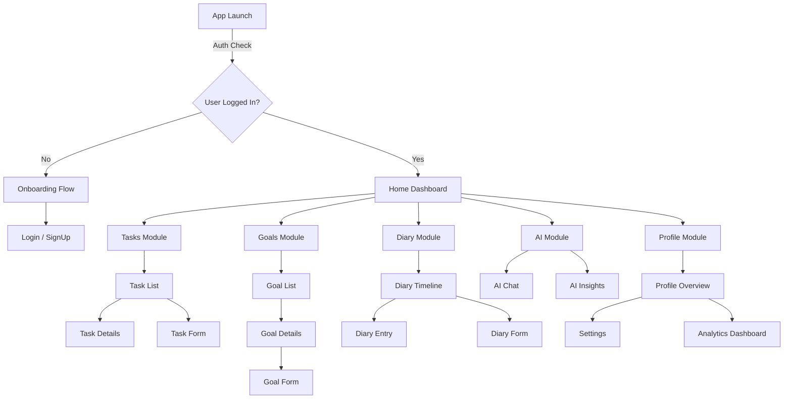

# Achievements Ahead - Master Design Document

**Version**: 1.0  
**Status**: Active Development  
**Platform**: iOS & Android (React Native / Expo)

---

## 1. 🌟 App Vision & Goals

### **Core Identity**
"Achievements Ahead" is not just a productivity tool; it is a **Supportive Companion** for personal growth. It rejects the "hustle culture" of anxiety-inducing apps in favor of a calm, encouraging, and emotionally intelligent approach.

### **The "Road Trip" Metaphor**
The app uses travel concepts to frame progress:
- **Goals** = Destinations
- **Tasks** = Steps/Fuel
- **Milestones** = Pit Stops
- **Diary** = Travel Log
- **AI** = Co-pilot / Navigator

### **Primary Goals**
1.  **Reduce Overwhelm**: Break big goals into manageable steps ("Milestones").
2.  **Emotional Safety**: Provide a non-judgmental space for reflection (Diary).
3.  **Proactive Support**: Use AI to offer encouragement, not just reminders.

---

## 2. 📋 Requirements

### **Functional Requirements**
-   **Authentication**: Login, Signup, Forgot Password, Persistent Session (Firebase).
-   **Task Management**: Create, Read, Update, Delete (CRUD) tasks; Filter by status.
-   **Goal Tracking**: Set long-term goals, define deadlines, track progress %.
-   **Personal Diary**: Log entries with mood tracking; View timeline.
-   **AI Assistant**: Chat interface for coaching; Visual insights dashboard.
-   **Profile**: View usage stats; Manage settings.

### **Non-Functional Requirements**
-   **Visual Tone**: Calm, "Premium Soft", Clean.
-   **Performance**: Immediate navigation, smooth transitions.
-   **Accessibility**: High contrast text option, readable font sizes (16px+ body).

---

## 3. 🗺️ Information Architecture (Sitemap)

The app follows a **Stack Navigation** hierarchy rooted in a central Dashboard.

---

## 4. 🎨 Design System ("Soft Confidence")

### **Color Palette**
| Role | Color | Hex | Feeling |
| :--- | :--- | :--- | :--- |
| **Primary** | Indigo 600 | `#4F46E5` | Confident, Trustworthy |
| **Secondary** | Indigo 400 | `#818CF8` | Supportive, Approachable |
| **Background** | Slate 50 | `#F8FAFC` | Airy, Clean, Light |
| **Surface** | White | `#FFFFFF` | Crisp, Structured |
| **Text Main** | Slate 800 | `#1E293B` | High Contrast, Soft Black |
| **Text Muted** | Slate 500 | `#64748B` | Subtle Details |
| **Success** | Emerald 500 | `#10B981` | Progress, Growth |
| **Error** | Red 500 | `#EF4444` | Attention (used sparingly) |

### **Typography**
-   **Headers**: `Poppins` (SemiBold/Medium) - Friendly, modern, geometric.
-   **Body**: `Inter` (Regular/SemiBold) - Highly legible UI font.

### **Component Library**

#### **Buttons (`MyButton`)**
-   **Primary**: Indigo background, White text, 16px radius. Used for main actions (e.g., "Create Task").
-   **Secondary**: Transparent/Light background, Indigo text. Used for secondary actions (e.g., "Cancel", "Edit").

#### **Cards (`GoalCard`, `AICard`)**
-   **Style**: White background, 16px radius, `Theme.shadows.sm` (subtle elevation).
-   **Interaction**: Touchable opacity (0.9) on press.

#### **Inputs (`MyInput`)**
-   **Style**: Light gray border (`#E2E8F0`), 56px height, rounded corners.
-   **Features**: Integrated icons (left/right), accessible labels.

---

## 5. 📱 Detailed Screen Breakdown

### **1. Onboarding (`screens/onBoarding.js`)**
-   **Purpose**: Welcome new users and gather initial preferences.
-   **Key Elements**:
    -   Multi-step wizard (Carousel style).
    -   "Card-like" selectable options for interaction.
    -   Start Button.

### **2. Authentication (`Login.js`, `SignUp.js`, `ForgotPassword.js`)**
-   **Purpose**: Secure entry.
-   **Key Elements**:
    -   `LogoHeader`: Welcoming title + subtitle.
    -   `KeyboardAvoidingView`: Prevents keyboard overlapping inputs.
    -   `SafeAreaView`: Ensures content doesn't hit notches.

### **3. Home Dashboard (`Home.js`)**
-   **Purpose**: The "Cockpit" - instant access to everything.
-   **Sections**:
    -   **Header**: Greeting ("Hello, User") + Avatar (Link to Profile).
    -   **AI Companion Card**: Prominent invite to chat ("Your Companion").
    -   **Quick Access Grid**: 4 Icons (Tasks, Goals, Diary, Profile) for fast navigation.
    -   **Current Destination**: A visual summary of the top-priority goal.
    -   **Today's Focus**: A mini-checklist of the top 2 urgent tasks.

### **4. Tasks Module (`screens/Tasks/`)**
-   **TaskList**:
    -   Filter Tabs: All / Pending / Completed.
    -   Floating Action Button (FAB): "+" to add task.
-   **TaskDetails**:
    -   Elements: Status Badge, Due Date (Calendar Icon), Priority Flag.
    -   Actions: Mark Complete, Delete.
-   **TaskForm**:
    -   Fields: Title, Description, Date Picker, "High Priority" Checkbox.

### **5. Goals Module (`screens/Goals/`)**
-   **GoalList**:
    -   Visuals: Progress bars showing completion %.
-   **GoalDetails ("The Roadmap")**:
    -   Uniques: Vertical timeline visualization. Points connected by a line.
    -   States: "Reached" (Filled Check) vs "Next Stop" (Empty Circle).

### **6. Diary Module (`screens/Diary/`)**
-   **DiaryTimeline**:
    -   List of cards showing Date + Mood Icon + Text Preview.
-   **DiaryForm**:
    -   **Mood Selector**: 3 big icon buttons (Smile, Neutral, Frown).
    -   **Text Area**: Large, multi-line input for reflection.

### **7. AI Module (`screens/AI/`)**
-   **AIChat**:
    -   Interface: Chat bubbles (Left = AI, Right = User).
    -   Tone: Supportive, coaching voice.
-   **AIInsights**:
    -   Visuals: Colored cards (Amber/Green/Red) summarizing "Peak Hours", "Burnout Risk", etc.

### **8. Profile & Analytics (`screens/Profile/`, `screens/Analytics/`)**
-   **Profile**:
    -   Stats Row: Quick count of Goals/Tasks.
    -   Menu: List of links (Settings, Analytics, Sign Out).
-   **AnalyticsDashboard**:
    -   Components: Bar charts (using CSS/View heights) for "Weekly Focus".

---

## 6. 🛤️ UX Workflows (User Journeys)

### **Journey A: The Morning Alignment**
1.  **Open App** -> Dashboard.
2.  **View "Today's Focus"** -> Mark top task as done.
3.  **Tap AI Card** -> "Good morning, let's plan your day."

### **Journey B: The Big Picture Check**
1.  **Dashboard** -> Tap "Goals" (Quick Access).
2.  **Select "Run Marathon"** -> View Map.
3.  **Tap "Add Milestone"** -> Add "Buy Shoes".

### **Journey C: The Evening Reflection**
1.  **Dashboard** -> Tap "Diary".
2.  **Tap "+"** -> Select "Feeling Good".
3.  **Write** -> "I made progress today." -> **Save**.
